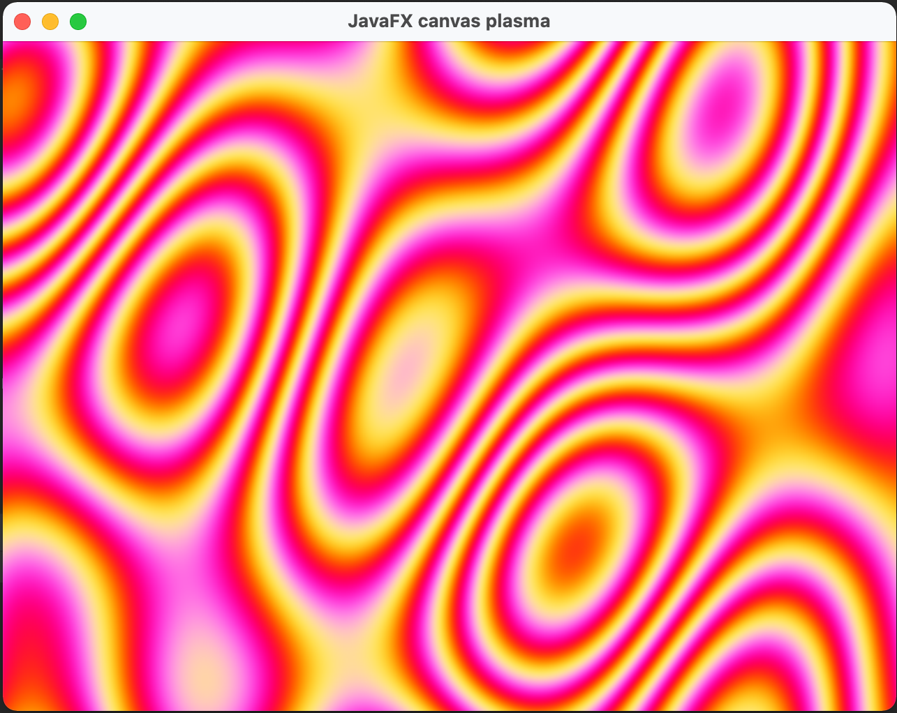

# javafx-canvas-plasma

Old school plasma effect with Java on JavaFX canvas.  
Java/JavaFX version of https://github.com/bertjan/html5-canvas-js-plasma.



### Building

**Requirements**
 - Java 17+
 - Maven 3.9.0 (use the provided wrapper)

1. Build the application
```
./mvnw verify
```
2. Copy all dependencies
```
./mvnw -Pjars
```
3. Provision all JDKS
```
./mvnw -Pjdks
```
4. Assemble Jlink and Jpackage (must be run on each target OS)
```
./mvnw -Passemble
```

Assembled distributions located at `target/jreleaser/assemble/`.
